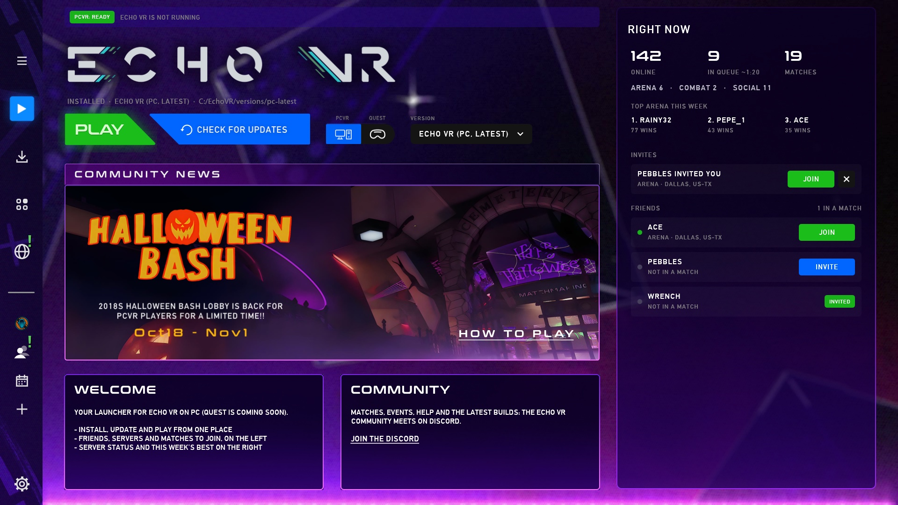
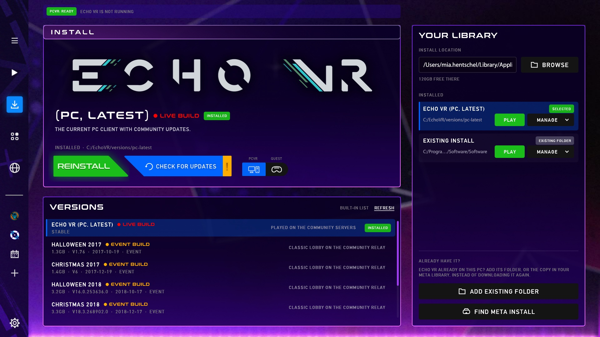
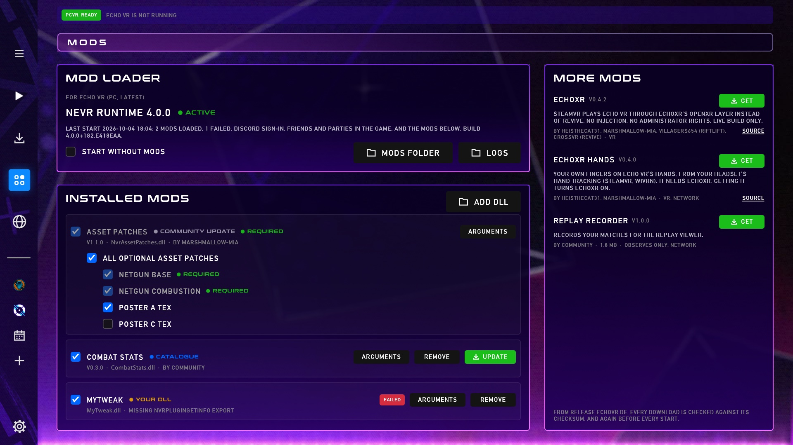
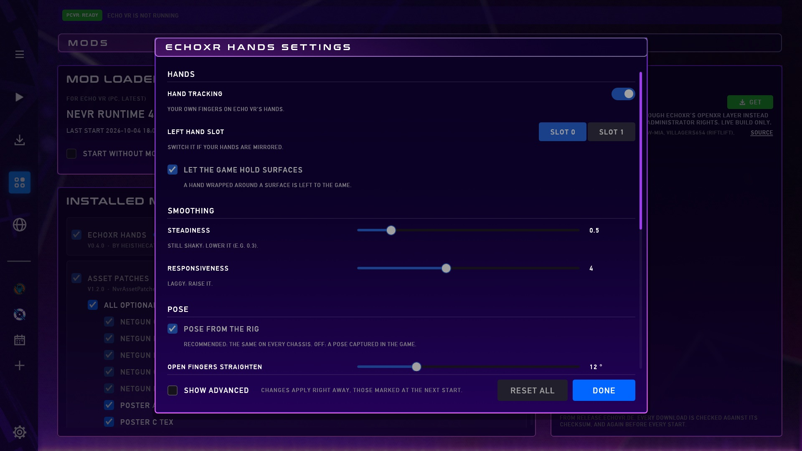
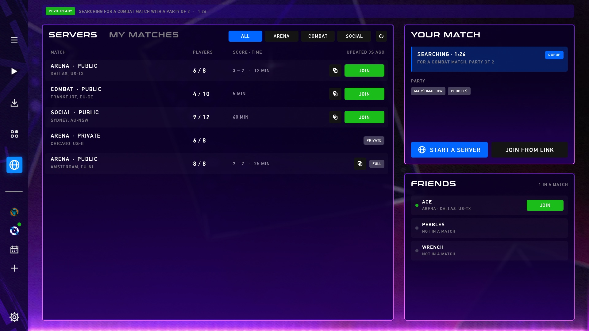
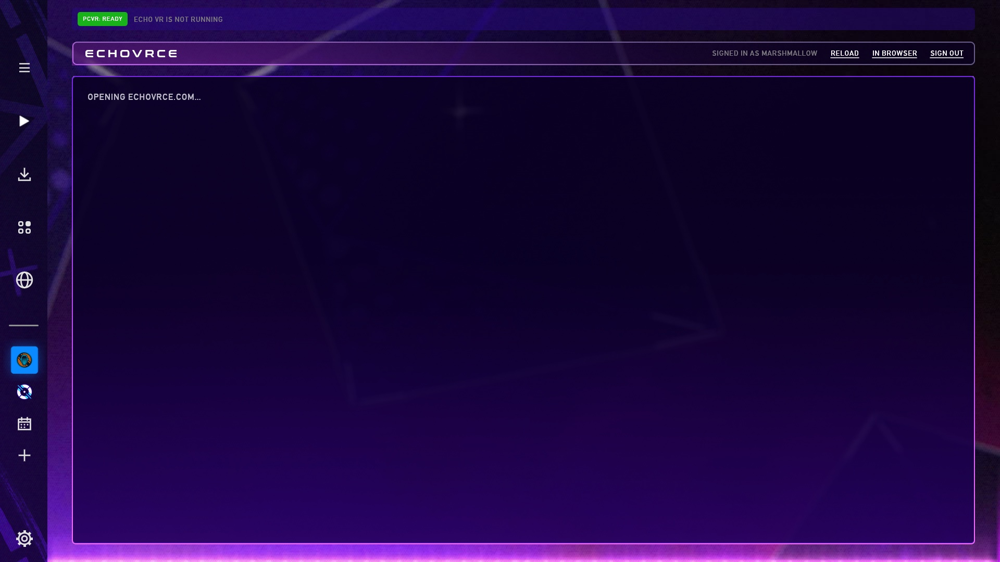
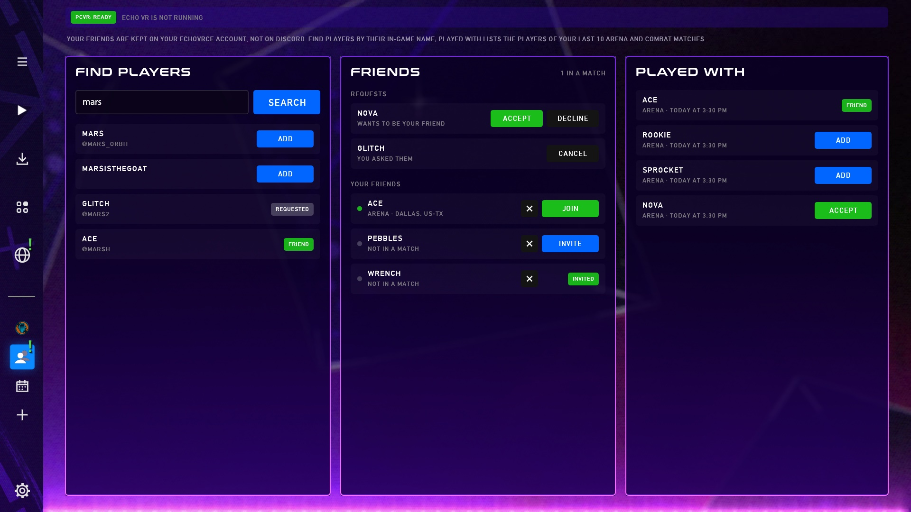
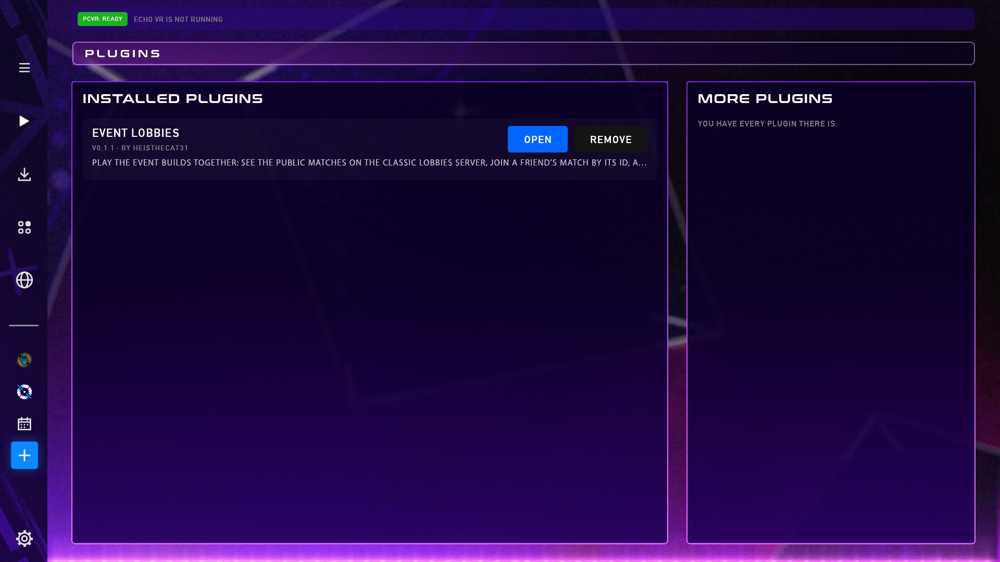
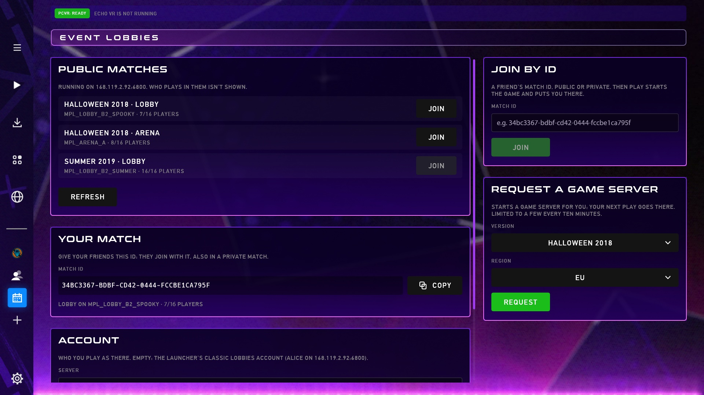
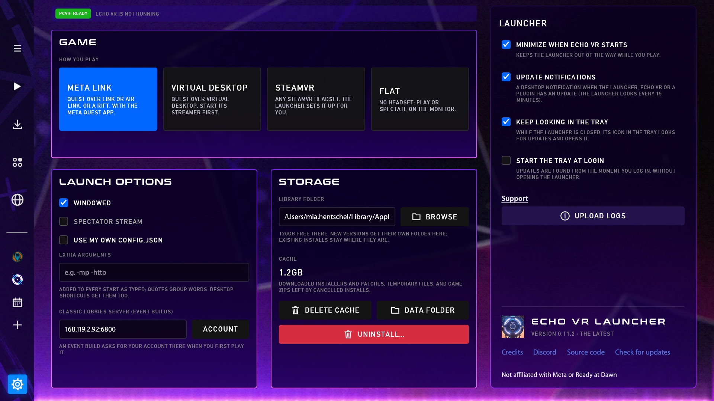

# Echo VR Launcher

Installs, updates and starts Echo VR on PC (Windows, Linux), and plays it on the
community's servers (EchoVRCE): PLAY on the Play page, with what's going on and your
friends to join on the right; the live servers, your match and invites on the Servers
page; mods on the Mods page. Echo VR on Quest is coming soon.

Download it from the [releases](https://github.com/marshmallow-mia/EchoVR_Launcher/releases).
On Windows, `-windows-setup.exe` installs it for you (no administrator rights: into
`%LOCALAPPDATA%\Programs\EchoVR_Launcher`, with Start menu and desktop shortcuts and an
uninstaller in Windows' Apps); `-windows.zip` is the same launcher to unpack anywhere.
On Linux, `-x86_64.AppImage` is the launcher in one file: make it executable and start it
(it updates itself, in place); `-linux.zip` and `-linux.tar.gz` are the same launcher to
unpack anywhere.
Help and news are on the [Echo VR Lounge Discord](https://discord.com/invite/echo-vr-lounge).

## Screenshots

| | |
|---|---|
|  **Play**: PLAY, the news, who's online, invites and friends to join |  **Install**: the live build and the event builds, your library |
|  **Mods**: nEVR, the mods you have and more to get |  **A mod's settings**, drawn from its own description |
|  **Servers**: the live matches, your match, party and friends |  **EchoVRCE**: echovrce.com inside the launcher, signed in |
|  **Friends**: requests, finding players, who you played with |  **Plugins**: apps inside the launcher, each with its own tab |
|  **Event lobbies** (a plugin): public matches, join by id, request a server |  **Settings**: how you play, launch options, storage, the launcher |

Players, matches and numbers in the pictures are made up; the mods and plugins are the real ones. The EchoVRCE page is the real site, with the account blurred.

All ten in one picture, one below the other: [docs/screenshots/00-all.jpg](docs/screenshots/00-all.jpg).

## Match links

The launcher joins matches from `spark://` and `https://echo.taxi/spark://…` links: paste one
into **Join** on the Play page or **Join from link** on the Servers page. On Windows and Linux
it also opens links clicked in Discord or the browser, if no other app (Spark) handles them
yet. **Open spark:// links** in Settings takes them over from Spark, or turns this off.
macOS can't pass links to the launcher, so paste them there.


## Already have Echo VR?

INSTALL looks for a copy first (the Meta app's libraries, `C:\EchoVR`, the launcher's own
library folder, and Wine prefixes on Linux) and offers **Use the copy on this PC**, or
**Choose echovr.exe** for one somewhere else. That copy is checked against the build's
checksums and added instead of downloading it again.

## Event builds

The event builds (Halloween 2017, Christmas 2017, Halloween 2018, Christmas 2018, Summer
2019) can be installed on Windows and Linux and play on the community's classic lobbies server:
on SteamVR through EchoXR or Revive, on Meta Link, or on Linux in VR through EchoXR. To hide
them, close the launcher and set `"event_builds": false` in its `launcher.json`
(`%LOCALAPPDATA%\EchoVR_Launcher` on Windows, `~/.local/share/EchoVR_Launcher` on Linux).

## Plugins

Plugins are apps inside the launcher, each with its own tab in the rail; the **+** tab gets
them. A plugin is a description of its page (`plugin.json`) that the launcher draws itself:
[docs/plugins/pages.md](docs/plugins/pages.md). The first one, Event lobbies, lists the
public matches of the event builds and joins a friend's match by its id.

## SteamVR on Windows

The SteamVR choice runs Echo VR through [Revive](https://github.com/LibreVR/Revive)
(installed by the launcher) or, with **EchoXR** installed on the Mods page, through
[EchoXR](https://github.com/marshmallow-mia/EchoXR)'s OpenXR layer in the game's folder: no
injection and no administrator rights (the Meta library's copy excepted). See
[docs/launcher/echoxr.md](docs/launcher/echoxr.md).

## Virtual Desktop on Windows

With Virtual Desktop chosen, Settings picks how its streamer runs Echo VR (**Through**):

- **Oculus mode**: Virtual Desktop's streamer starts Echo VR itself and gives it the
  headset, as its Games list (and its tray's Inject Game) does:
  `VirtualDesktop.Streamer.exe <echovr.exe> <launch options>`. Echo VR started on its own
  would land on Meta's runtime, which has no headset under Virtual Desktop.
- **SteamVR (EchoXR)**: through EchoXR on SteamVR, which Virtual Desktop's SteamVR driver
  streams (SteamVR installed).
- **VD's OpenXR (EchoXR)**: through EchoXR on Virtual Desktop's own OpenXR runtime
  (`EchoXR.exe --runtime active`): neither SteamVR nor Meta's runtime.

PLAY sets EchoXR up the first time it's needed. When a start in Oculus mode stops without VR
("Failed to create OVR D3D swap chain", or no headset), the launcher closes the game and
offers the EchoXR routes instead.

## Antivirus

The live build loads nEVR (`bin\win10\BugSplat64.dll`) at its start, and Windows only says
"unable to start correctly" (0xc0000135, 0xc0000022, 0xc0000043) when antivirus removed or
blocked it. The launcher checks the file before PLAY and right after an update puts it in
place, and reads those codes when a start ends. It then says so and offers **Allow and
repair**, which adds the game's folder to Windows Security's exclusions (with administrator
rights; only a folder of a version the launcher has) and puts the file back, or **Open
Windows Security**.

## Hand tracking

**EchoXR Hands** (Mods page, More mods) puts your own fingers on Echo VR's hands
([EchoXR Hands](https://github.com/EchoTools/EchoXR-Hands) by heisthecat31 and
marshmallow-mia). It needs EchoXR (getting it turns EchoXR on): its OpenXR layer reads your
fingers from the runtime's hand tracking in Echo VR's own session, so it plays on SteamVR and
on WiVRn. The launcher puts its nEVR plugin into the game's `plugins` folder and enables the
layer for each start (`XR_API_LAYER_PATH`, `XR_ENABLE_API_LAYERS`). Finger sharing starts
off: on, it sends your display name and your match's player names to its relay, so others
running it see your fingers.

## Linux

The PC version plays on Linux through Steam. The first **PLAY** (and the first after an
update of them) downloads a private GE-Proton and [EchoXR](https://github.com/marshmallow-mia/EchoXR)'s OpenXR layer (it
answers Echo's Oculus calls over OpenXR, so SteamVR, Monado or WiVRn drive the headset),
reads Meta's Platform SDK loader and P2P library out of Meta's own runtime package, and
adds Echo VR to Steam as a non-Steam game (it asks first: Steam restarts for that, once),
then starts it through Steam.
How you play (Settings, or the Install card) is **SteamVR** or **WiVRn**, whichever is
installed, or Flat. In VR, EchoXR is required (the Mods page lists it as required), and PLAY
points it at that runtime: it starts SteamVR when it isn't running, and WiVRn's server
(connect your headset in WiVRn's app). `XR_RUNTIME_JSON`, when set, still wins. No OpenVR
runtime is needed. The live build and the event builds run this way.
Under Proton the game can't rate the graphics card on its first start and used to pick Low:
the GPU Rating plugin ([NvrGpuRating](https://github.com/marshmallow-mia/NvrGpuRating), a
required mod, also in the event builds) gives it the card's numbers, and a Low preset saved
before is rated again once (your other game settings stay).
SteamVR 2.17.9 and 2.17.10 lose the graphics card on NVIDIA under Linux (Valve's bug): the
launcher says so when it happens, and SteamVR's "previous" branch (Properties, Betas) plays.

## Mods

The **Mods** page shows the selected PC version's mod loader
([nEVR runtime](https://github.com/EchoTools/nevr-runtime), the game's `BugSplat64.dll`,
which also brings Discord sign-in, friends and parties into the game) and what it loaded
at the last start, lets you turn plugins and asset patches on or off, set a plugin's
arguments, start without mods, and install mods from the catalogue on release.echovr.de or a
DLL of your own. **Installed mods** lists only what is installed; **More mods** offers the
rest (the catalogue's optional plugins, EchoXR Hands and, on Windows, EchoXR) with **Get**. The launcher keeps its choices in its own files and writes nEVR's
`_local/config.yaml` from them before every start, so updates and Verify never undo them.
Signed in with EchoVRCE, the launcher also signs the game in, so it doesn't ask in the
browser. See
[docs/launcher/mods.md](docs/launcher/mods.md).

Only verified plugins load: the community update's and the catalogue's. A DLL of your own
(or one put into the plugins folder by hand) loads once local plugins are on in that
version's loader config (`x-local-plugins: true` in `_local/config.yaml`); writing a plugin
and loading it is in [docs/plugins/local-plugins.md](docs/plugins/local-plugins.md).

**Content packs** are mods that bring game data as well as plugins (EchoCombat: new gear and
scripts). One install, one switch; nothing in the game's own files changes, and they need
nEVR's early load pass (the Beta channel for now). A pack that changes gameplay plays on
servers of its own: Settings → Launch options → **EchoCombat server** sets one, and while
the pack is on the game signs in and finds matches there. See
[docs/launcher/mods.md](docs/launcher/mods.md#content-packs).

**Dev codes** let mod and plugin makers test their work before it's published: with a code
in Settings → Advanced settings → **Dev mods and plugins**, the launcher also lists their
dev folder's mods and plugins (with a Dev tag). How a folder is filled, packs included:
[docs/launcher/dev-folders.md](docs/launcher/dev-folders.md).

## Updates

The launcher looks for updates when it starts and every 15 minutes: a newer launcher (its
GitHub releases), an update of each installed Echo VR that gets updates (its update
manifest changed since the launcher last brought it up to date), and a new version of a
plugin installed from the catalogue. Nothing installs by itself: a dot on the rail (Play,
Mods, Settings) and the status bar say what is out, PLAY's side button becomes **Update
ready**, and the Mods page has **Update** on the plugin; the launcher's own update is **Update now** in
Settings (Windows and Linux: it downloads the release, checks it, replaces its files, or
the AppImage, and restarts; macOS opens the release page). EchoXR and EchoXR Hands come with the launcher, so a launcher
update brings theirs.

**Settings → Advanced settings** picks the launcher's channel: **main** (the tested
releases), **beta** (fixes to try before they reach main) or **alpha** (the newest
builds). Betas are tagged `vX.Y.Z-beta.N` and alphas `vX.Y.Z-alpha.N`, published as
GitHub prereleases; beta gets main's releases too, alpha all three. Off main, the status
bar says so (**BETA CHANNEL**). Back on main, main's newest launcher is offered as
**Switch now**.

Each update is also announced once as a desktop notification (Linux: the desktop's
notifications; Windows: a toast). While the launcher is closed, its icon in the tray
(`EchoVR_Launcher --tray`, started by the launcher) keeps looking and opens it; it can
start at login. Settings → Launcher turns each of these off. No tray on macOS.

## Building from source

The launcher is written in Rust (GUI: [egui](https://github.com/emilk/egui)). With a stable
[Rust toolchain](https://rustup.rs):

```sh
cargo run              # debug build
cargo build --release  # target/release/EchoVR_Launcher(.exe)
cargo test             # unit tests (add `-- --ignored` for the network tests)
```

The bundled `adb` lives in `assets/platform-tools/`; `scripts/fetch-platform-tools.sh <version>`
refreshes it from Google's platform-tools release. Logs are written to the per-user data
directory (`%LOCALAPPDATA%\EchoVR_Launcher\logs` on Windows,
`~/Library/Application Support/EchoVR_Launcher/logs` on macOS,
`~/.local/share/EchoVR_Launcher/logs` on Linux). A folder from the launcher's days as the
Echo VR Installer (`EchoVR_Installer`) is moved over at the first start.

`ECHOVR_SNAPSHOTS=<dir> cargo run` renders every screen to PNGs in `<dir>` and exits, which is
handy for checking UI changes. Add `ECHOVR_SNAPSHOTS_DEMO=1` to render the launcher with
two made-up versions (nothing is saved).

## License

Copyright (C) 2024-2026 the Echo VR Launcher contributors

This program is free software: you can redistribute it and/or modify it under
the terms of the GNU General Public License as published by the Free Software
Foundation, either version 3 of the License, or (at your option) any later
version.

This program is distributed in the hope that it will be useful, but WITHOUT ANY
WARRANTY; without even the implied warranty of MERCHANTABILITY or FITNESS FOR A
PARTICULAR PURPOSE. See the [GNU General Public License](LICENSE) for more
details.

You should have received a copy of the GNU General Public License along with
this program. If not, see <https://www.gnu.org/licenses/>.
